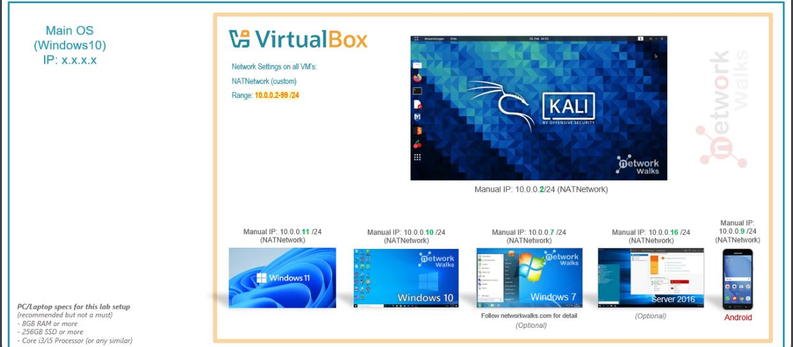
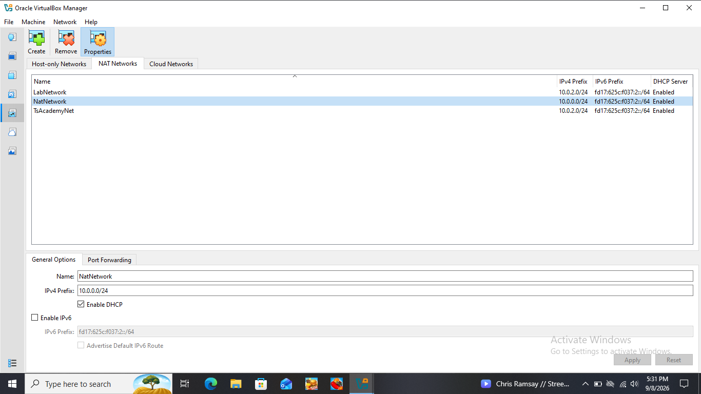
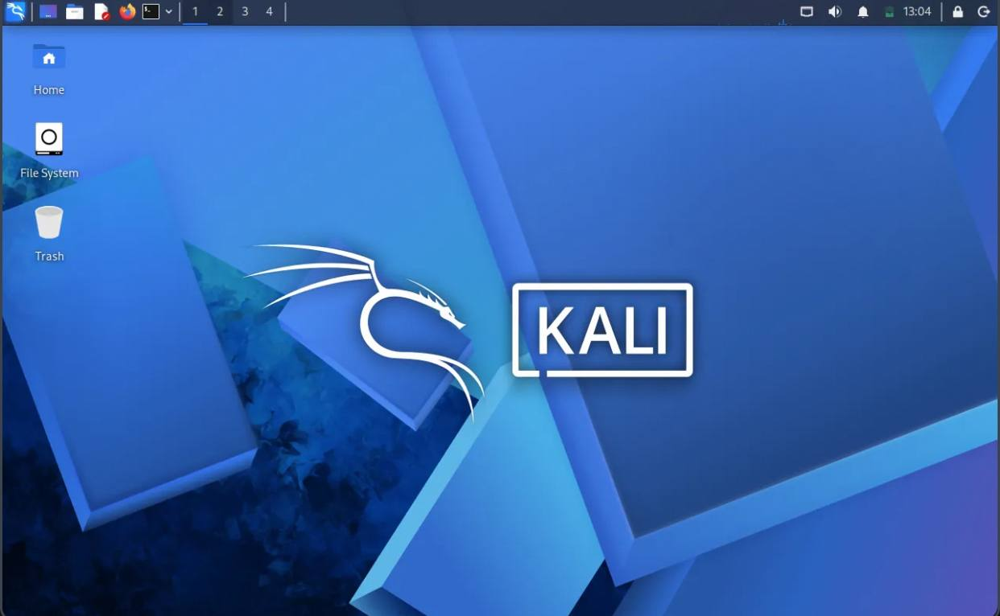
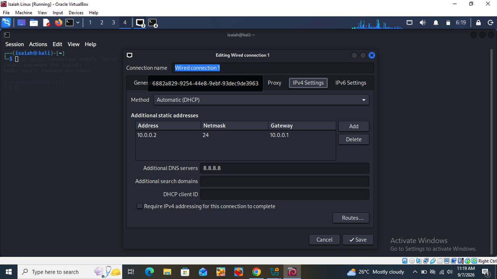

# Building a Cybersecurity Practice Lab with Kali Linux
A hands-on virtual environment set up for learning ethical hacking and penetration testing fundamentals

         

## 📌 About This Project
This project documents how I built a personal cybersecurity lab using VirtualBox and Kali Linux. The goal was to create a safe, isolated environment where I could practice security tools, learn network scanning, and get comfortable with penetration-testing basics without touching any real production system.

The VM runs on its own private network, separate from my main computer, which means I can later add more machines to the same setup and use them as practice targets for future exercises.
## 📸 Screenshots

*Lab architecture overview showing the host machine, VirtualBox, and Kali Linux VM*

*VirtualBox NAT Network settings used for this lab*

*Kali Linux desktop running inside VirtualBox*

*Static IP configuration set on the Kali Linux VM*

## 🎯 What I Set Out to Do
- Set up VirtualBox as my hypervisor
- Import Kali Linux as a virtual machine
- Build a dedicated NAT Network just for this lab
- Get Kali properly connected with a fixed IP address
- Test that the connection and DNS resolution both actually work
- Save a clean snapshot in case anything breaks later
- Write up everything I did, including the problems I ran into

## 🛡️ Why This Setup Matters
Having an isolated lab means I can experiment freely — scanning, testing tools, practicing techniques — without any risk to real systems or networks. This lab is meant for things like:
- Learning basic reconnaissance
- Practicing port scanning
- Exploring vulnerability assessment tools
- Getting familiar with packet-level analysis
- General hands-on ethical hacking practice

⚠️ **Note:** Everything here is done only on systems I own and control. This lab is not to be used against any system I don't have explicit permission to test.

## ⚙️ My Lab Setup
| Component | Details |
|---|---|
| Host OS | Windows 10 |
| Hypervisor | VirtualBox 7.2 |
| Guest OS | Kali Linux 2026.2 |
| Base Memory (Kali VM) | 1536 MB |
| Processors | 2 |
| Graphics Controller | VMSVGA |
| Storage | 20 GB (SATA) |
| Network Type | NAT Network ("NatNetwork") |
| Network Range | 10.0.0.0/24 |
| Kali IP Address | 10.0.0.2/24 |
| Gateway | 10.0.0.1 |
| DNS | 8.8.8.8 |

## 🪜 How I Set It Up

### Step 1. Installed VirtualBox
Downloaded and installed VirtualBox 7.2 as the base hypervisor for the whole lab.

### Step 2. Built a dedicated NAT Network
Rather than using the default NAT setting, I created a separate NAT Network so future VMs could all communicate with each other while still reaching the internet.

### Step 3. Imported Kali Linux
Downloaded the official Kali Linux VM image and imported it into VirtualBox. Adapter 1 was attached to my custom NAT Network.

### Step 4. Configured Kali's network settings
Set a fixed IP address inside Kali so it stays consistent every time the VM starts:
## 🔍 How I Verified the Lab
| Test | Command | What I Expected |
|---|---|---|
| Check IP address | `ip a` | Correct address on eth0 |
| Test gateway | `ping 10.0.0.1` | Successful replies |
| Test internet | `ping google.com` | Successful replies |
## ✅ Example Results
IP Address:
10.0.0.2/24

Gateway:
10.0.0.1

DNS:
8.8.8.8
## 🐛 Problems I Ran Into (and How I Solved Them)

### Problem 1: NAT Network prefix didn't match my static IP setup
After configuring Kali with a manual IP of 10.0.0.2, the connection suddenly stopped reaching the internet on a later attempt — pinging the gateway returned "Destination Host Unreachable." Checking VirtualBox's Network Manager, I found the actual NAT Network prefix was set to `10.0.2.0/24`, not `10.0.0.0/24` — meaning my manual IP and gateway didn't actually belong to the real network range.

**Fix:** I edited the NAT Network's IPv4 Prefix directly in VirtualBox's Network Manager (with the VM shut down first) and changed it to `10.0.0.0/24` to match my Kali configuration. After restarting the VM, the gateway and internet connection both worked again.

### Problem 2: Confusing terminal output when checking my connection
When first verifying my setup, `ip a` didn't clearly show my expected address at a glance, and `ifconfig` displayed unfamiliar flags like BROADCAST, RUNNING, and MULTICAST that looked like errors at first glance.

**Fix:** Testing actual connectivity with `ping` confirmed the network was fine. I learned these flags are just normal status indicators, not errors, and that checking the correct interface and testing real connectivity is more reliable than reading raw command output alone.

### Problem 3: Couldn't find the network settings menu
I initially struggled to locate where to configure Kali's IPv4 settings.

**Fix:** Found it by clicking the network icon in the top-right menu bar on the Kali desktop, then selecting "Edit Connections" to access the IPv4 settings tab.

## 💡 What I Learned
This project taught me the basics of building and maintaining a virtual lab environment for cybersecurity practice — particularly how NAT Networks work differently from standard NAT, how static IP addressing ties into the underlying network prefix, and why matching those two correctly matters for a connection to work at all. I also learned that documenting problems honestly, not just the parts that worked, is part of doing this properly.

## 🔒 Security & Ethical Use
This laboratory is intended strictly for personal learning purposes. It must only be used on systems I own or have explicit permission to test — never against unauthorized systems.

## 🔗 Tools & Resources
- VirtualBox: https://virtualbox.org/wiki/Downloads
- Kali Linux: https://kali.org/get-kali

## 👤 Author
Salifu Isaiah
Cybersecurity Enthusiast B083
GitHub: [CyberIsaiah](https://github.com/CyberIsaiah)
LinkedIn: [salifu-isaiah](https://linkedin.com/in/salifu-isaiah)

## 📌 Project Information
Program Name: Cybersecurity at Networkwalks | Week: 01 | Project: Cybersecurity & Pentesting Lab Setup | Repository: GitHub
